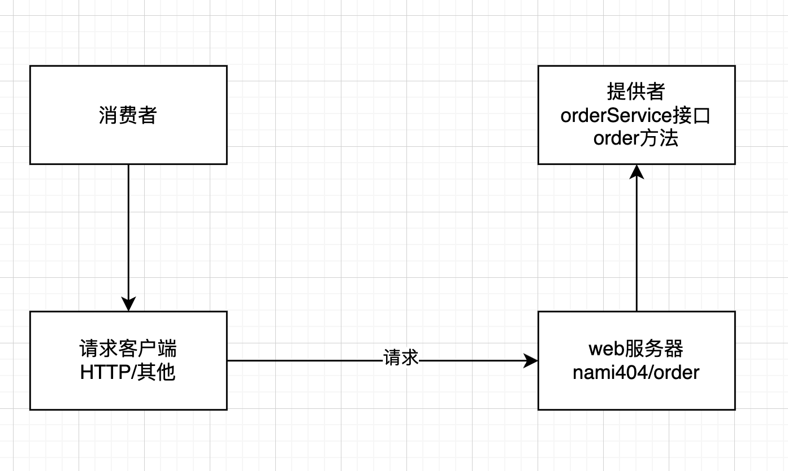
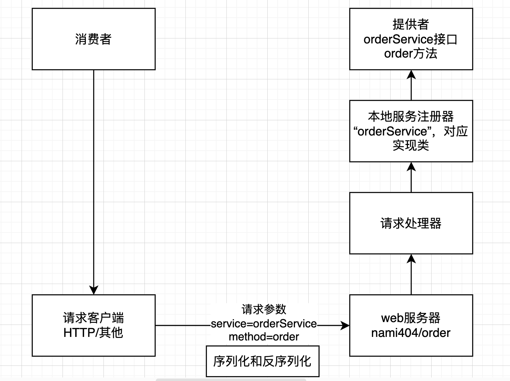
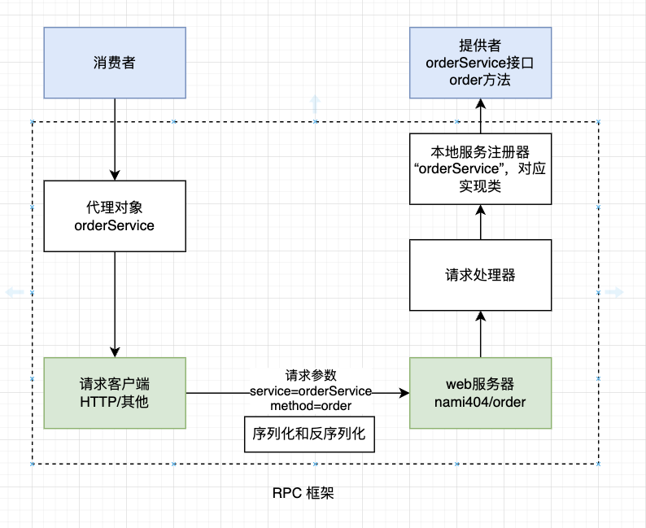
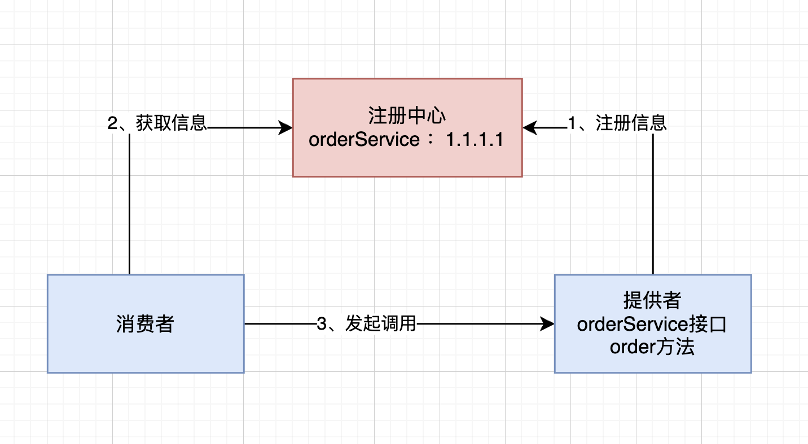
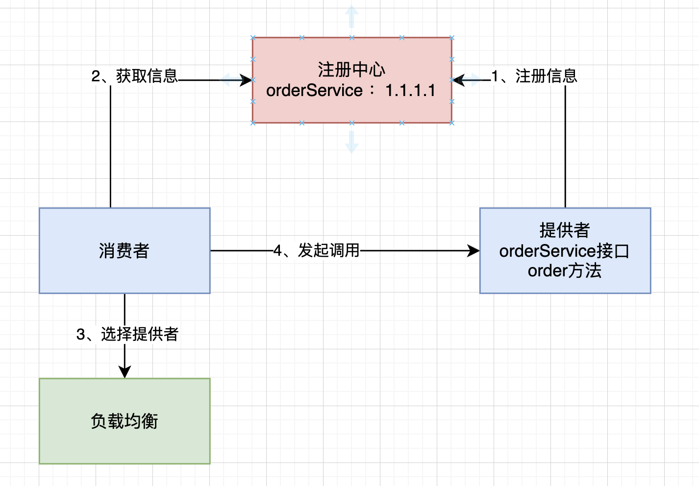
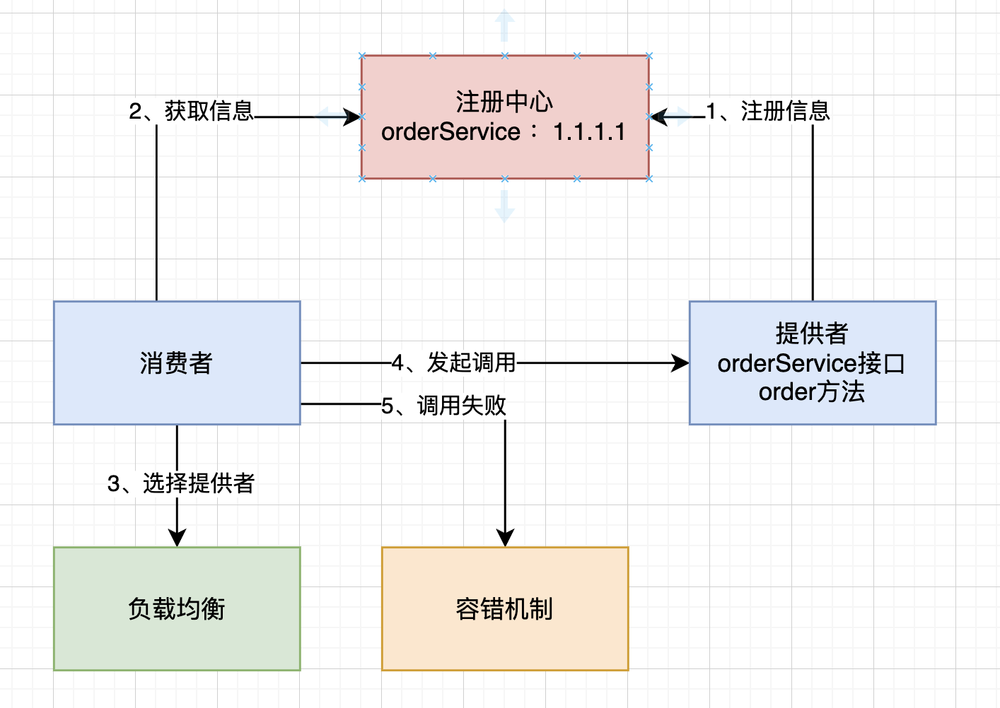

# 简易版实现RPC框架
模块介绍：
- common：代码的公共依赖，包括接口、Model等
- consumer：服务消费者代码
- provider：服务提供者代码
- rpc：简易版RPC 框架

## 一、基本概念
### 什么是RPC？
RPC（Remote Procedure Call）即远程过程调用，是一种计算机通信协议，允许程序在不同的计算机之间进行通信和交互，就像本地调用一样。

### 为什么需要RPC？
RPC允许一个程序（常把这个称为服务消费者）像调用自己程序的方法一样，调用另一个程序（称为服务提供者）的接口，而不需要了解数据的传输处理过程、底层网络的细节等。这些都会由RPC框架帮你完成，使得开发者可以轻松调用远程服务，快速开发分布式系统。

如果没有RPC框架，假设这里有项目B要调用项目A，那项目B要怎么调用项目A呢？

首先，由于项目A和项目B都是独立的系统，不能像SDK 一样作为依赖包引入。那么就需要项目A提供web 服务，并且编写一个接口暴露服务，比如访问`https://github.com/nami404` 就能调用服务；然后项目B作为服务消费者，需要自己构造请求，并通过HttpClient 请求上述地址。如果项目B需要调用更多的第三方服务，每个服务和方法的调用都编写一个HTTP 请求，那么会非常麻烦！

而有了RPC 框架，项目B就可以一行代码即可完成调用！

## 二、RPC框架实现思路
### 基本设计
#### RPC框架为什么能帮我们简化调用？如何实现一个RPC框架呢？
其实很简单，一开始有服务消费者和服务提供者两个角色，消费者想要调用提供者，就需要提供者启动一个`web 服务`，然后通过`请求客户端` 发送HTTP 或者其他协议的请求来调用。

比如请求`nami404/order`地址后，提供者会调用orderService 的order 的方法：

但如果提供者提供了很多服务和方法，每个接口和方法要单独写一个接口吗？消费者要针对每个接口写一段HTTP 调用的逻辑嘛？

其实可以提供一个统一的服务调用接口，通过`请求处理器`根据客户端的请求参数来进行不同的处理、调用不同的服务和方法。

可以在服务提供者程序维护一个`本地服务注册器`，记录服务和对应实现类的映射。

举个例子，消费者要调用orderService 服务的order 方法，可以发送请求，参数为`service=orderService,method=order`，然后请求处理器会根据service从服务注册器中找到对应的服务实现类，并且通过Java 的反射机制调用method 指定的方法。

需要注意的是，由于Java 对象无法直接在网络中传输，所以要对传输到参数进行`序列化`和`反序列化`。

为了简化消费者发请求的代码，实现类似本地调用的体验。可以基于代理模式，为消费者要调用的接口生成一个代理对象，由代理对象完成请求和相应的过程。

至此，一个最简易的RPC框架架构图诞生了：

### 扩展设计
虽然上述设计已经跑通了基本调用流程，但离一个完备的RPC 框架还有很大的差距，接下来进一步完善下架构设计。

#### 1. 服务注册发现
问题1： 消费者如何知道提供者的调用地址呢？

类比生活场景，点外卖时，外卖小哥如何知道我们的地址和店铺地址？肯定是买家和卖家分别填写地址，由平台来保存的。

因此我们需要一个`注册中心`，来保存服务提供者的地址。消费者要调用服务时，只需从注册中心获取对应服务的提供者地址即可。

架构图如下：

一般用现成的第三方注册中心，比如Redis、Zookeeper即可。

#### 2. 负载均衡
问题2：如果有多个服务提供者，消费者应该调用哪个服务提供者呢？

我们可以给服务调用方增加负载均衡能力，通过指定不同的算法来决定调用哪一个服务提供者，比如轮询、随机、根据性能动态调用等。

架构图如下：

#### 3. 容错机制
问题3：如果服务调用失败，应该如何处理呢？

为了保证分布式系统的高可用，我们通常会给服务的调用增加一定的容错机制，比如失败重试、降级调用其他接口等等。

架构图如下：

#### 4. 其他
如果想要做一个优秀的RPC 框架，还需要考虑很多问题。
比如：
- 服务提供者下线了怎么办？需要一个失效节点剔除机制。
- 服务消费者每次都从注册中心拉取信息，性能会不会很差？可以使用缓存来优化性能
- 如何优化RPC 框架的传输通讯性能？比如选择合适的网络框架、自定义协议头、节约传输体积等。
- 如何让整个框架更利于扩展？比如使用Java 的SPI 机制、配置化等等。

